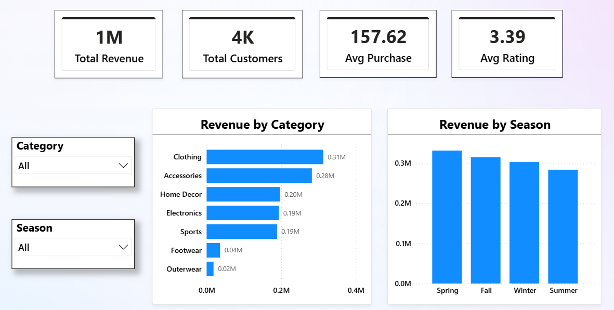
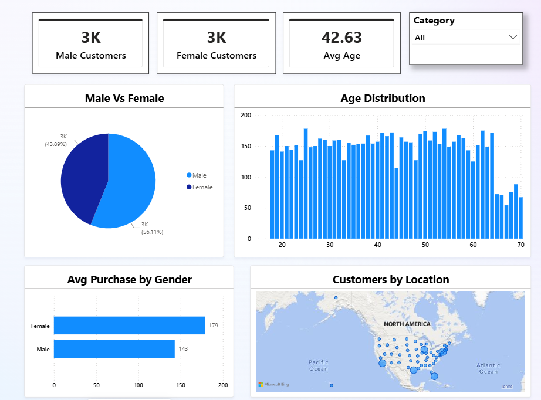
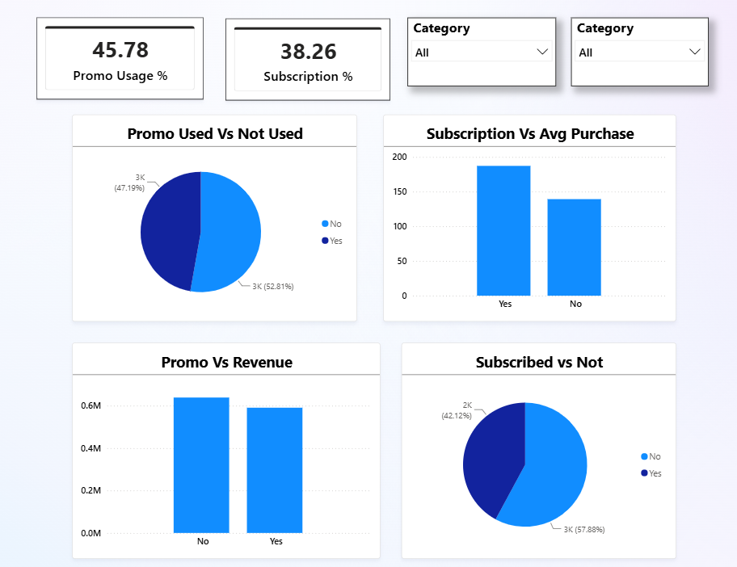
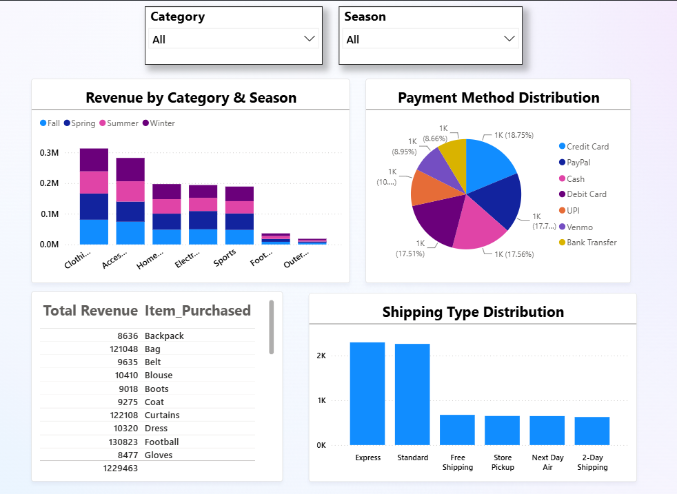
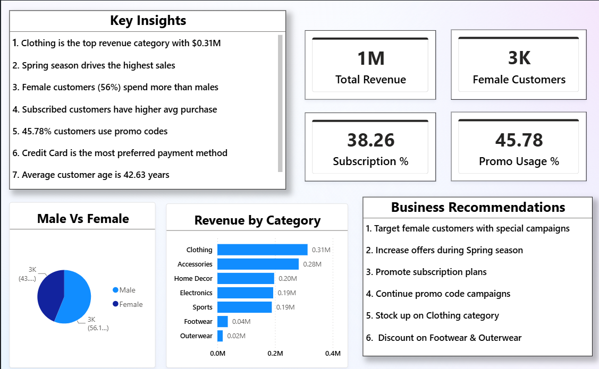

# Shopping Trends Analysis Dashboard

## 📊 Project Overview
Analysis of 7,800 customer shopping records
using Excel and Power BI.

## 🎯 Key KPIs
- Total Revenue: $1M
- Total Customers: 4K
- Avg Purchase: $157.62
- Avg Rating: 3.39

## 🔍 Key Insights
- Clothing top category — $0.31M revenue
- Female customers 56% — spend more
- Spring drives highest sales
- 45.78% customers use promo codes
- Subscribed customers buy more

## 🛠️ Tools Used
- Power BI
- Excel
- DAX

## 📸 Dashboard Screenshots

